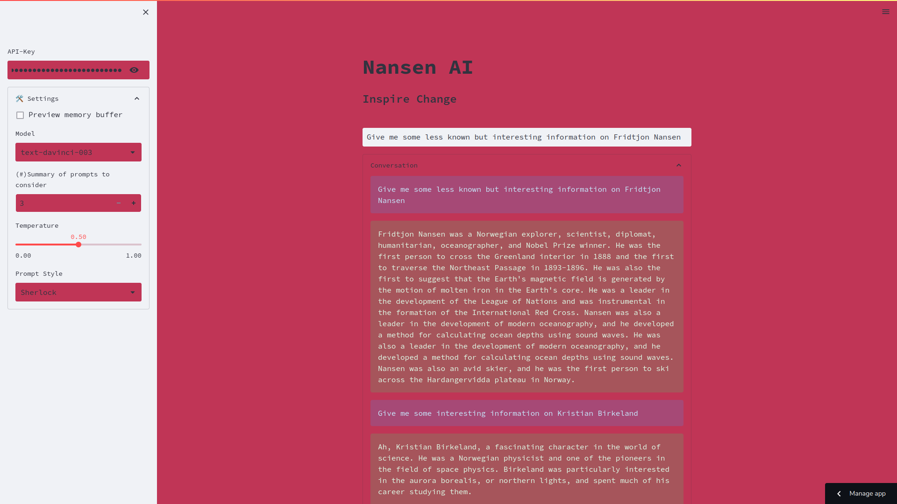
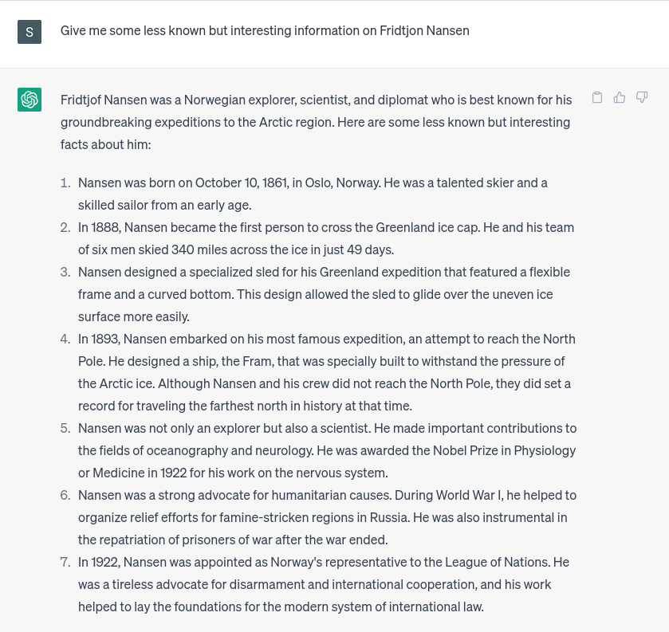
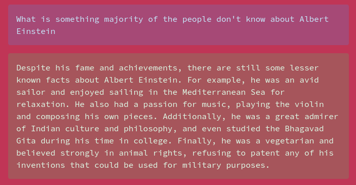
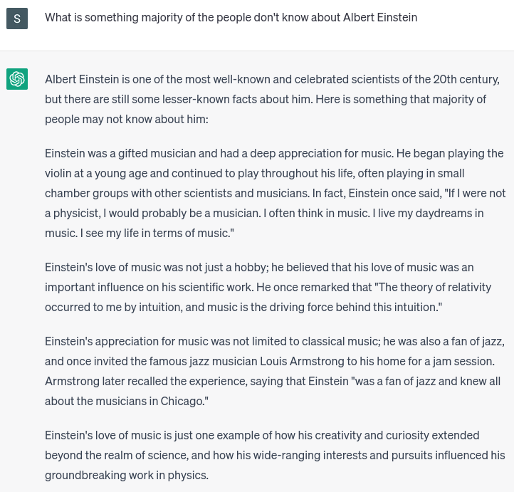
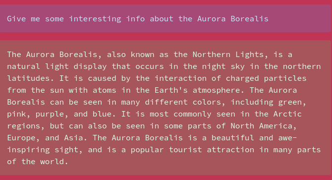
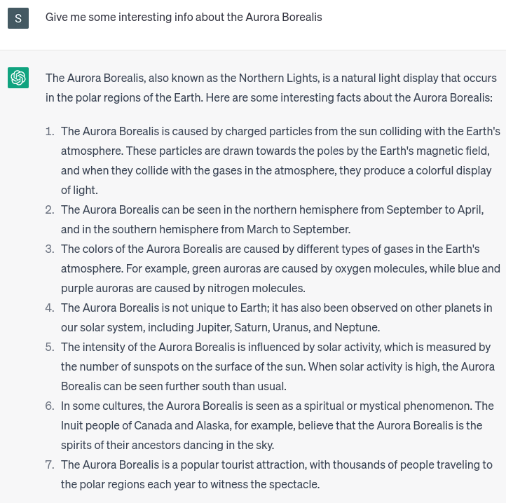

  

# About Nansen
He is a GPT-3.5 based flexible and customizable LLM application that was made for the purpose of assisting with Climate Change and Weather Forecasting fundamentally and broadly for anything that's good for us and our environment. But on the way he has been curated to do more that just that. And he'll be updated once in a while for quite some time. Have fun with it until your API tokens get exhausted. Use them wisely :)

## How to use it?

Pretty easy I guess, you can just [Click Here to wake Nansen up](https://nansen-ai.streamlit.app/)
- Go to the side menu and enter down your API key from OpenAI.
- Extend the Settings tab
- Select the Model you need from the dropdown. (`gpt-3.5-turbo` being the most powerful)
- Enter the Summary of prompts as in the number of previous messages to consider while answering you (Your `history` can be customized)
- Temperature - here's the magic, 0 to 1 is the range of randomness, 1 being the highest (recommended by our testing team : `5`)
- Prompt Style decides which side of Nansen you need to see.

## What are the different prompts?
We have 4 different options available right now, after introducing Sherlock as the latest.

-Sherlock is the costume of Nansen where you can learn some interesting information about anything you ask in a concise easy to understand manner. It investigates for you and gives you what you want

-Non-Environmetal is just the model you choose with little to no change.

-Zero-Shot is where the environmental responsibility kicks in with a little bit of passion and answers only domain-specific answers, but you can ask anything

-Few-Shot is a little more passionate,it is a 60 year old Nanson retired from teaching environmental studies lecturing his grandchildren with a lot of details he learnt in his life

What you use is based on the purpose of your visit, enjoy all the flavours ;)

## First look at Sherlock
Let's see the difference between how Sherlock answers and how ChatGPT answers:

  

---------------

  

---------------

  

---------------

  

---------------

  

---------------

  

## How to run it locally?

- Install the dependancies in the `requirements.txt`.
- Now make the `final.py` available locally.
- Get your Open AI API token ready!!
- Now open your terminal and create a `.streamlit` directory in your home(~) directory.
- Now download the `config.toml` file in this repository and add it int the same directory.
- Now you can just use `streamlit run final.py` to run it.
- Most important part of all, if it doesn't work get back to us on sankalpkarthi3@gmail.com or in [LinkedIn](https://www.linkedin.com/in/sankalp-karthi-a4b5b1215)

It's recommended to implement the above in a virtualenvironment (We used `pipenv` for this), it's just a good habit.
